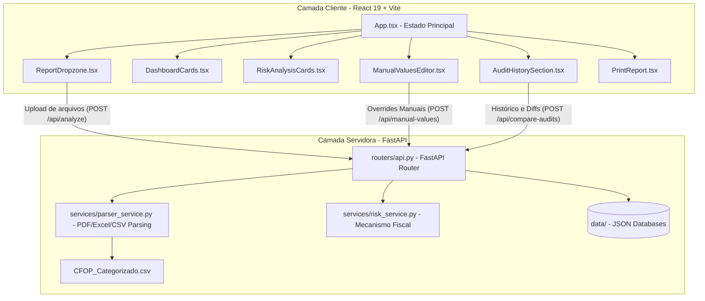

# 🌌 Contexto do Projeto: Analisador de Risco - Simples Nacional

Este documento fornece um mapeamento completo da arquitetura, estrutura de arquivos, tecnologias e fluxos de dados do **Analisador de Risco do Simples Nacional**. Ele serve como guia definitivo de contexto técnico para desenvolvedores e agentes de IA que operam no repositório.

---

## 🎯 1. Visão Geral do Sistema

A aplicação é uma ferramenta de auditoria fiscal digital preditiva desenvolvida especificamente para empresas brasileiras enquadradas no regime de tributação do **Simples Nacional**. 

Seu objetivo é simular e avaliar os riscos de **exclusão de ofício** da empresa do regime simplificado, com base nos limites impostos pelo **Artigo 29 da Lei Complementar nº 123/2006**:

*   **Inciso X (Limite de Compras - 80%):** As aquisições de mercadorias para comercialização ou industrialização não podem ultrapassar **80% dos ingressos de recursos (faturamento/receita)** no mesmo período, salvo casos justificados de aumento de estoque. A violação gera presunção legal imediata de omissão de receita.
*   **Inciso IX (Limite de Despesas - 120%):** A soma das despesas pagas (compras, folha de pagamento, pró-labore, custos operacionais e tributos) não pode superar **120% do faturamento** do período. Ultrapassar essa marca presume que a empresa opera com recursos não declarados.

---

## 🏢 2. Arquitetura de Alto Nível

O projeto adota uma arquitetura clássica de desacoplamento entre cliente e servidor, otimizada para desenvolvimento rápido local:



---

## 📂 3. Árvore de Diretórios Comentada

Abaixo está o mapeamento detalhado da estrutura do repositório:

```text
D:\analisador-de-risco-simples-nacional\
│
├── .antigravitycli/          # Configurações do ambiente do agente
├── .venv/                    # Ambiente virtual Python (Backend)
├── dist/                     # Build de produção do frontend (estático compilado)
├── node_modules/             # Dependências Node.js
├── scratch/                  # Scripts e arquivos temporários de teste
│
├── backend/                  # 🐍 Subsistema do Servidor (Python)
│   ├── app/                  # Pacote principal da aplicação FastAPI
│   │   ├── routers/
│   │   │   ├── __init__.py
│   │   │   └── api.py        # Endpoints expostos (auditoria, histórico, overrides)
│   │   ├── services/
│   │   │   ├── __init__.py
│   │   │   ├── parser_service.py # Leitores especializados de XLSX, PDF, CSV e TXT
│   │   │   └── risk_service.py   # Implementação matemática do Art. 29
│   │   ├── utils/
│   │   │   ├── __init__.py
│   │   │   ├── file_utils.py     # Leitura/escrita dos bancos de dados JSON locais
│   │   │   └── text_utils.py     # Sanitização numérica e regex de CFOPs
│   │   ├── __init__.py
│   │   ├── config.py         # Metadados de relatórios, CFOP_MAP e Perfis de Simulação
│   │   ├── main.py           # Inicialização e configuração de CORS do FastAPI
│   │   └── models.py         # Esquemas de validação Pydantic para as APIs
│   │
│   ├── data/                 # 💾 Armazenamento Local (Bancos JSON leves)
│   │   ├── history.json      # Logs e auditorias salvas para rastreabilidade
│   │   └── manual_values.json # Cache de parametrizações inseridas manualmente
│   │
│   ├── app.py                # Legado/Módulo monolítico completo do backend
│   ├── test_parser.py        # Suite de validação e testes dos parsers fiscais
│   └── tests/                # Testes automatizados adicionais
│
├── exemples/                 # 📄 Arquivos modelo para simulação de upload
│   ├── AGROBORGES - FOLHA - 01-2026.csv
│   ├── AGROBORGES - FOLHA - 02-2026.csv
│   ├── AGROBORGES - FOLHA - 03-2026.csv
│   ├── AGROBORGES - ICMS - 01-2026.csv
│   └── AGROBORGES - ISS - 01-2026.csv
│
├── src/                      # ⚛️ Subsistema Frontend (React + TS + Tailwind)
│   ├── components/           # Componentes encapsulados de UI
│   │   ├── AlertManager.tsx        # Renderização dinâmica de cards de alerta e leis
│   │   ├── AuditHistorySection.tsx # Painel de busca, deleção e comparação de auditorias
│   │   ├── DashboardCards.tsx      # Cards de resumo estatístico e progresso visual
│   │   ├── ManualValuesEditor.tsx  # Painel de inserção e simulação numérica rápida
│   │   ├── PrintReport.tsx         # Layout otimizado para impressão de relatórios fiscais
│   │   ├── ReportDropzone.tsx      # Upload drag-and-drop inteligente e categorizador
│   │   └── RiskAnalysisCards.tsx   # Painéis com vereditos legais do Inciso IX e X
│   │
│   ├── data/
│   │   └── templates.ts      # Modelos estáticos de dados e referências
│   ├── utils/                # Utilitários globais do front (atualmente vazio)
│   ├── App.tsx               # Orquestrador central e gerenciador de estado do front
│   ├── index.css             # Importações globais do Tailwind CSS e estilos personalizados
│   ├── main.tsx              # Ponto de entrada do React
│   └── types.ts              # Interfaces do TypeScript compartilhadas
│
├── CFOP_Categorizado.csv     # 📊 Tabela de referência do fisco para conversão de CFOPs
├── package.json              # Manifesto do projeto Node, scripts e dependências
├── package-lock.json         # Travamento de dependências NPM
├── requirements.txt          # Requisitos do backend Python
├── tsconfig.json             # Diretrizes de compilação do TypeScript
├── vite.config.ts            # Arquivo de configuração do Vite (com proxy para api)
└── README.md                 # Documentação básica de setup
```

---

## 🛠️ 4. Stack de Tecnologias

Abaixo estão detalhadas as tecnologias utilizadas nos dois lados da aplicação:

### Frontend
| Tecnologia | Função / Papel no Sistema |
| :--- | :--- |
| **React 19** | Biblioteca de composição e renderização baseada em componentes reativos. |
| **TypeScript** | Garante tipagem estática e integridade de dados fiscais em toda a UI (`types.ts`). |
| **Vite v6** | Ferramenta de build extremamente veloz e servidor HMR. |
| **TailwindCSS v4** | Motor de estilos utilitários integrado via compilador do Vite, permitindo design responsivo fluido. |
| **Motion** (Framer) | Fornece micro-animações premium e transições suaves de abas e modais. |
| **Lucide React** | Conjunto moderno de ícones vetoriais. |

### Backend
| Tecnologia | Função / Papel no Sistema |
| :--- | :--- |
| **FastAPI** | Framework assíncrono para criação de APIs estáveis e autoinformadas. |
| **Uvicorn** | Servidor ASGI de altíssima performance para executar a aplicação FastAPI. |
| **Pandas** | Leitura e tratamento estruturado de dados tabulares vindos de planilhas Excel (`.xlsx`). |
| **PyPDF (pypdf)** | Extração nativa de textos de relatórios e extratos fiscais emitidos em `.pdf`. |
| **Pydantic v2** | Tipagem estática e validação automática de payloads JSON no backend. |
| **CSV (Nativo)** | Biblioteca nativa de processamento de fluxos delimitados, essencial para o arquivo `CFOP_Categorizado.csv`. |

---

## 🔄 5. Fluxos de Dados Fundamentais

### A. Fluxo de Upload e Análise Fiscal Automática
Este é o coração do sistema. Ele permite que o usuário simplesmente anexe arquivos fiscais reais obtidos no ERP ou portal do Fisco.

```text
[Usuário] ──> Arrasta arquivos para ReportDropzone
               │
               ▼
[Dropzone] ──> Envia chamada "POST /api/detect-type"
               │   (Detecta se o arquivo é Compras, Vendas, Serviços, Folha, etc.)
               ▼
[Dropzone] ──> Prepara multipart/form-data e executa "POST /api/analyze"
               │
               ├──> [FastAPI Router] ──> Encaminha para services/parser_service.py
               │                          │
               │                          ├──> Extrato em PDF ──> Extrai com PdfReader
               │                          ├──> Planilha Excel ──> Converte via Pandas DataFrame
               │                          └──> CSV ou TXT     ──> Lê diretamente em blocos de texto
               │
               ├──> [FastAPI Parser] ──> Sanitiza os valores (trata R$, pontos e vírgulas)
               │                          │
               │                          └──> Para cada linha: Extrai CFOP (ex: 1.102)
               │                                │
               │                                └──> Consulta CFOP_MAP (CFOP_Categorizado.csv)
               │                                      │
               │                                      └──> Classifica como Compra, Venda, 
               │                                           Serviço Prestado/Tomado ou Despesa
               │
               ├──> [FastAPI Risk Engine] ──> Computa Faturamento (Saídas) e Despesas (Entradas)
               │                              Calcula porcentagem dos Incisos IX e X
               │                              Gera alertas contextuais e vereditos
               │
               ▼
[React UI] <── Retorna payload JSON estruturado contendo resultados e alertas formatados
```

### B. Fluxo de Simulação e Overrides Manuais
Para análises onde o usuário não possui os arquivos fiscais ou deseja testar cenários hipotéticos ("E se meu faturamento subir 20%?"), ele pode usar o **ManualValuesEditor**:

1.  **Carregamento:** Ao abrir o editor manual de uma empresa/período, a UI faz um `GET /api/manual-values?company=...&period=...`. O backend verifica se já existem dados salvos no cache `manual_values.json`. Caso negativo, retorna um modelo vazio.
2.  **Edição:** O usuário altera campos numéricos (Vendas, Compras, Pró-Labore, Despesas).
3.  **Cálculo em Tempo Real:** Cada alteração envia os dados para `POST /api/manual-values`. O backend persiste o estado no JSON e reavalia a matemática tributária do Art. 29 imediatamente, devolvendo os novos alertas e riscos para atualização instantânea dos gráficos e termômetros visuais.

### C. Fluxo de Histórico e Comparação de Auditorias
O painel de histórico (`AuditHistorySection`) provê rastreabilidade completa e possibilita ver a evolução financeira da empresa:

*   **Salvar Auditoria:** Com os resultados em tela, o usuário salva o registro. O front envia um `POST /api/history`. O backend gera um ID único, anexa um timestamp real e adiciona o registro no topo de `history.json`.
*   **Comparação Cruzada:** O usuário pode selecionar dois cards quaisquer do histórico (Auditoria A e Auditoria B) e clicar em "Comparar". O front dispara um `POST /api/compare-audits` contendo os dois IDs. O backend busca ambos em `history.json`, calcula as variações absolutas de faturamento, compras e despesas, calcula o delta percentual e sinaliza se houve mudança de status legal do Simples Nacional (ex: passou de Regular para Em Risco).

---

## ⚖️ 6. Lógica Fiscal e Regras de Negócio (Mapeador de CFOPs)

O principal diferencial técnico do analisador é a **resiliência na classificação**. O sistema não depende de estruturas rígidas de colunas nos relatórios importados; em vez disso, ele utiliza heurísticas baseadas em **CFOPs (Código Fiscal de Operações e Prestações)**.

### Mapeamento do Arquivo `CFOP_Categorizado.csv`
A aplicação carrega dinamicamente mais de 300 códigos CFOP mapeados de acordo com sua tipicidade. A classificação funciona da seguinte forma:

| Grupo de CFOP | Categoria Classificada | Influência nos Indicadores |
| :--- | :--- | :--- |
| **Iniciados em 5, 6** (Exceto Serviços) | Vendas | Incrementa Receitas / Faturamento. |
| **CFOP 9.xxx** (ou sob categoria de Saída de Serviço) | Serviços Prestados | Incrementa Receitas / Faturamento. |
| **CFOPs de Compras** (ex: `1.102`, `2.102`, `1.403`) | Compras | Base de cálculo do **Inciso X** (Limite de 80%). |
| **CFOP 8.xxx** (ou Entrada de Serviços) | Serviços Tomados | Computado como Outras Despesas no **Inciso IX**. |
| **CFOPs de Uso e Consumo / Fretes** (ex: `1.556`, `2.352`) | Transporte / Consumo | Computado como Outras Despesas no **Inciso IX**. |
| **CFOPs de Ativo Imobilizado / Devoluções** (ex: `1.551`, `1.202`) | Desconsiderados | Ignorados no cálculo de limites (não afetam as contas de forma prejudicial). |

### Heurística de Tratamento Financeiro
O parser usa a função `clean_and_parse_float` do módulo `text_utils.py` que executa limpeza agressiva de strings por meio de expressões regulares:
1.  Remove caracteres não numéricos como `"R$"`, espaços e símbolos de moeda.
2.  Avalia o formato de separação de milhares e decimais (`.` e `,`).
3.  Determina de forma inteligente se uma vírgula representa decimal (padrão brasileiro `1.500,00`) ou milhar (padrão americano `1,500.00`), convertendo de forma segura em um valor de ponto flutuante compatível com Python.

---

## 🚀 7. Como Iniciar o Desenvolvimento

Para rodar a aplicação em seu ambiente local, siga as diretrizes abaixo:

### ⚡ Passo 1: Executar o Frontend (React + Vite)
Instale as dependências Node e inicie o servidor:
```bash
npm install
npm run dev
```
O frontend subirá por padrão na porta **3000** (`http://localhost:3000`).

### 🐍 Passo 2: Executar o Backend (FastAPI)
1. Ative seu ambiente virtual (se necessário) e instale as dependências Python:
```bash
pip install -r requirements.txt
```
2. Inicialize o servidor ASGI Uvicorn:
```bash
python -m uvicorn backend.app.main:app --reload --port 8000
```
O backend rodará na porta **8000** (`http://localhost:8000`). O Vite já está pré-configurado via `vite.config.ts` para repassar chamadas `/api` automaticamente para esta porta, evitando problemas de CORS no navegador.

### 🧪 Passo 3: Executar Testes Fiscais
Para testar os algoritmos de parsing e validação de CFOPs locais:
```bash
python backend/test_parser.py
```

---

## 🛠️ 8. Notas de Atualização e Resolução de Débito Técnico

Em Maio de 2026, a aplicação passou por uma refatoração estrutural crítica para resolver débitos técnicos de arquitetura e bugs de conciliação de estado manual-automático:

### A. Sincronização e Simetria de Contrato (Outras Receitas)
- **O Problema**: Ao importar um relatório e tentar inserir dados no editor de "Outras Receitas", o sistema sofria um crash na renderização devido à ausência do campo `outrasReceitasContabilizadas` no dicionário retornado pelo motor de cálculo do backend monolítico (`app.py`).
- **A Solução**: Sincronizamos o contrato da API adicionando explicitamente a propriedade `outrasReceitasContabilizadas: float = 0.0` nos modelos Pydantic (`AnalysisResultsModel`) e nos retornos de cálculo das funções `calculate_risk` e `calculate_risk_from_values` em `backend/app.py`.

### B. Correção de Persistência no Histórico de Auditorias
- **O Problema**: A gravação de novos registros de auditorias no histórico do painel lateral sempre persistia `importResults` (resultado bruto dos arquivos), descartando silenciosamente qualquer sobreposição manual de dados ativos feita pelo usuário.
- **A Solução**: Alteramos o frontend (`src/App.tsx`) para passar `currentResults={activeResults}` ao `<AuditHistorySection>`. Agora, a gravação de auditorias persiste fielmente o estado reativo correto (mesclado com overrides manuais).

### C. Suporte Visual no Relatório de Impressão (PDF/Excel)
- **A Solução**: Atualizamos o componente `src/components/PrintReport.tsx` para renderizar condicionalmente a linha de "↳ Outras Receitas" na tabela de receitas tributáveis, mantendo os totais de faturamento e despesas do relatório impresso 100% coerentes com os cards de status e progresso visual do dashboard reativo.

### D. Resolução de Colisões de Importação (Débito de Caminho de Módulos)
- **O Problema**: Devido à coexistência da pasta de pacote modular `backend/app/` e do arquivo de script monolítico `backend/app.py`, o python e o Uvicorn sofriam colisões de importação sob o nome `app` (ex: `Attribute "app" not found in module "app"` ou falhas ao rodar testes).
- **A Soluções**:
  1. **Testes Unitários**: O script `backend/tests/test_calculator.py` foi atualizado para carregar o módulo monolítico de forma encapsulada via `importlib.util.spec_from_file_location`, evitando o envenenamento e a colisão de pacotes.
  2. **Inicialização do Uvicorn**: O bloco `if __name__ == "__main__":` do `backend/app.py` foi modificado para passar o objeto FastAPI instanciado diretamente à execução: `uvicorn.run(app, host="127.0.0.1", port=8000)`. Isso removeu a dependência de strings do Uvicorn e permitiu um boot instantâneo e robusto em modo de desenvolvimento local.

---

🌌 *Documento atualizado em conformidade com as diretrizes do ecossistema Antigravity. Use-o como base para todas as futuras modificações funcionais.*
