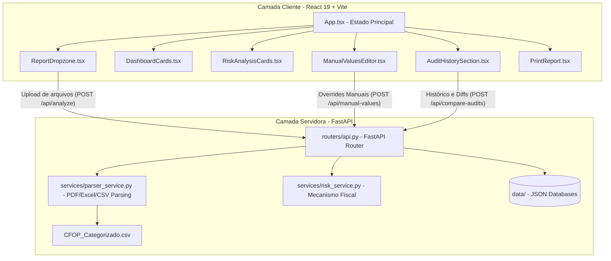

# 🚀 Analisador de Risco - Simples Nacional

[](https://react.dev/)
[](https://fastapi.tiangolo.com/)
[](https://tailwindcss.com/)
[](https://www.typescriptlang.org/)
[](https://www.python.org/)
[](https://vite.dev/)

O **Analisador de Risco do Simples Nacional** é uma ferramenta de auditoria fiscal digital preditiva desenvolvida para empresas brasileiras optantes pelo regime tributário simplificado. A aplicação avalia automaticamente o risco de exclusão de ofício com base nos parâmetros estabelecidos pelo **Artigo 29 da Lei Complementar nº 123/2006**.

O sistema concilia o faturamento e as despesas da empresa a partir do processamento inteligente de relatórios fiscais reais (PDF, Excel, CSV ou TXT), gerando alertas instantâneos, vereditos legais fundamentados e relatórios de auditoria prontos para impressão.

---

## 🎯 1. Contexto Fiscal e Regras de Negócio

A exclusão de ofício do Simples Nacional ocorre quando o Fisco identifica que a empresa ultrapassou os limites saudáveis de despesas e compras em relação ao seu faturamento declarado, gerando uma presunção imediata de omissão de receita. Esta ferramenta audita preventivamente as duas regras cruciais do **Art. 29 da LC 123/2006**:

### ⚖️ Inciso X — Limite de Compras (80%)
> As aquisições de mercadorias para comercialização ou industrialização não podem ultrapassar **80% dos ingressos de recursos (faturamento/receita)** no mesmo período, salvo casos justificados de aumento de estoque.
*   **Fórmula Básica:** `Total de Compras / Faturamento Total <= 80%`
*   **Implicação:** Ultrapassar este limite presume legalmente que a empresa adquiriu mercadorias com recursos não declarados (caixa 2).

### ⚖️ Inciso IX — Limite de Despesas (120%)
> A soma das despesas pagas (incluindo compras, folha de pagamento, pró-labore, custos operacionais, serviços tomados e tributos) não pode superar **120% do faturamento** no mesmo período.
*   **Fórmula Básica:** `Total de Despesas / Faturamento Total <= 120%`
*   **Implicação:** Operar com despesas que superam 120% do faturamento presume que a empresa está injetando dinheiro não declarado na operação para sustentar o déficit operacional.

---

## 🔄 2. Fluxo de Dados e Funcionamento do Sistema

O analisador foi desenhado para ser resiliente a layouts instáveis de exportações de ERPs. A conciliação fiscal apoia-se em inteligência de classificação baseada em códigos CFOP e processamento flexível de texto:



### Principais Etapas do Fluxo:
1. **Upload e Detecção Inteligente:** O usuário envia relatórios e extratos no `ReportDropzone`. O backend detecta automaticamente se os arquivos contêm registros de compras, vendas, serviços ou folha de pagamento (`POST /api/detect-type`).
2. **Parser e Sanitização de Texto:** Em `parser_service.py`, os dados são limpos (removendo "R$", pontos e vírgulas de forma inteligente) e associados à tabela de referência de mais de 300 códigos em `CFOP_Categorizado.csv` para rotulação fiscal automática (Vendas, Compras, Outras Despesas ou Ignorados).
3. **Mecanismo Fiscal (Risk Engine):** Consolida os dados e aplica as regras do Art. 29 da LC 123/2006.
4. **Simulação e Overrides:** O `ManualValuesEditor` permite testar cenários hipotéticos ou preencher campos manualmente. Todas as atualizações recalculam instantaneamente os riscos de exclusão na tela.
5. **Histórico e Comparação Cruzada:** A aplicação persiste as auditorias salvas em um banco de dados local leve (`history.json`), viabilizando a busca, exclusão e comparação cruzada de duas auditorias para avaliação de variações financeiras e transições de status fiscal.

---

## 🛠️ 3. Stack Tecnológica

### Frontend
*   **React 19.0.1** (Arquitetura moderna e reativa baseada em componentes funcionais)
*   **TypeScript 5.8.2** (Garantia de integridade de dados e interfaces estritas para auditoria)
*   **TailwindCSS v4** (Estilização utilitária de alta performance)
*   **Motion (Framer)** (Micro-animações premium e transições fluidas de abas)
*   **Lucide React** (Conjunto de ícones vetoriais modernos)

### Backend
*   **FastAPI 0.115.8** (Construção ágil de APIs assíncronas com documentação integrada)
*   **Pandas 3.0.3** (Processamento rápido e estruturado de planilhas Excel `.xlsx`)
*   **PyPDF 4.1.0** (Extração nativa e limpa de textos em extratos fiscais em PDF)
*   **Pydantic v2** (Validação automatizada de dados e tipagem forte nos endpoints)
*   **CSV & JSON (Nativos)** (Bancos de dados locais leves e eficientes para portabilidade)

---

## 📂 4. Estrutura do Projeto

Abaixo encontra-se o mapeamento das pastas mais importantes para auxiliar no desenvolvimento:

```text
├── backend/                        # 🐍 Subsistema do Servidor (Python)
│   ├── app/                        # Pacote principal da aplicação FastAPI
│   │   ├── routers/
│   │   │   └── api.py              # Endpoints da API (auditoria, histórico, simulação)
│   │   ├── services/
│   │   │   ├── parser_service.py   # Leitores de arquivos (XLSX, PDF, CSV, TXT)
│   │   │   └── risk_service.py     # Mecanismo matemático de cálculo fiscal (Art. 29)
│   │   ├── utils/
│   │   │   ├── file_utils.py       # Acesso e gravação nos bancos JSON locais
│   │   │   └── text_utils.py       # Expressões regulares e sanitização de dados fiscais
│   │   ├── config.py               # Mapeamentos de CFOP e configurações globais
│   │   ├── main.py                 # Inicialização do FastAPI, CORS e Uvicorn
│   │   └── models.py               # Modelos de dados e validação do Pydantic
│   ├── data/                       # 💾 Banco de Dados Local (JSON)
│   │   ├── history.json            # Histórico de auditorias finalizadas
│   │   └── manual_values.json      # Cache de parametrizações manuais simuladas
│   ├── tests/                      # Testes automatizados do ecossistema fiscal
│   └── app.py                      # Módulo monolítico consolidado do backend
│
├── src/                            # ⚛️ Subsistema Frontend (React + TypeScript)
│   ├── components/                 # Componentes de UI encapsulados
│   │   ├── AlertManager.tsx        # Card de fundamentação legal e leis vigentes
│   │   ├── AuditHistorySection.tsx # Painel de histórico e comparador de simulações
│   │   ├── DashboardCards.tsx      # Indicadores de faturamento, despesas e compras
│   │   ├── ManualValuesEditor.tsx  # Simulador interativo de dados financeiros
│   │   ├── PrintReport.tsx         # Layout otimizado para impressão/PDF do relatório
│   │   ├── ReportDropzone.tsx      # Área de arrastar e soltar com classificação automática
│   │   └── RiskAnalysisCards.tsx   # Painéis com termômetros e vereditos dos Incisos IX e X
│   ├── App.tsx                     # Orquestrador central e gerenciador de estado global
│   ├── index.css                   # Estilização global e diretivas TailwindCSS
│   └── types.ts                    # Interfaces de dados compartilhadas
│
├── exemples/                       # 📄 Exemplos de relatórios reais para simulações
├── CFOP_Categorizado.csv           # 📊 Base de classificação tributária de CFOPs do Fisco
├── package.json                    # Scripts e dependências do frontend (NPM)
├── requirements.txt                # Dependências do backend (PIP)
└── vite.config.ts                  # Configurações do Vite (com Proxy configurado para a porta do backend)
```

---

## 🚀 5. Como Iniciar o Desenvolvimento

### 📋 Pré-requisitos
*   **Node.js** (versão 18 ou superior)
*   **Python** (versão 3.11 ou superior)

### ⚡ Passo 1: Configurar e Executar o Frontend
1. Instale as dependências da aplicação:
   ```bash
   npm install
   ```
2. Inicialize o servidor de desenvolvimento do Vite:
   ```bash
   npm run dev
   ```
   *O frontend será executado em [http://localhost:3000](http://localhost:3000).*

### 🐍 Passo 2: Configurar e Executar o Backend
1. Crie e ative seu ambiente virtual do Python (opcional, porém recomendado):
   ```bash
   python -m venv .venv
   # No Windows (Powershell):
   .venv\Scripts\Activate.ps1
   # No Linux/macOS:
   source .venv/bin/activate
   ```
2. Instale as dependências do servidor:
   ```bash
   pip install -r requirements.txt
   ```
3. Inicie o servidor FastAPI em modo de recarregamento dinâmico (hot reload):
   ```bash
   python -m uvicorn backend.app.main:app --reload --port 8000
   ```
   *O backend rodará em [http://localhost:8000](http://localhost:8000).* 
   
   > [!NOTE]
   > O Vite está pré-configurado no arquivo `vite.config.ts` com um proxy reverso. Toda requisição enviada a `/api` pelo frontend será redirecionada automaticamente para a porta `8000`, evitando qualquer bloqueio de política CORS.

### 🧪 Passo 3: Executar Testes Fiscais
Para assegurar que o mapeador de CFOPs e o motor de cálculo estão funcionando perfeitamente, execute a suite de testes fiscais locais:
```bash
python backend/test_parser.py
```

---

## ⚖️ 6. Mapeamento de CFOPs (Regras Fiscais)

O arquivo [CFOP_Categorizado.csv](file:///D:/analisador-de-risco-simples-nacional/CFOP_Categorizado.csv) mapeia a influência de cada operação nas contas da empresa:

| Prefixo/Código de CFOP | Categoria Classificada | Impacto no Dashboard |
| :--- | :--- | :--- |
| **Dígitos iniciais 5 e 6** (Exceto Serviços) | Vendas de Mercadorias | Soma ao Faturamento (Ingressos de Recursos). |
| **CFOPs 9.xxx** (ou Saídas de Serviços) | Serviços Prestados | Soma ao Faturamento (Ingressos de Recursos). |
| **CFOPs de Aquisição** (ex: `1.102`, `2.102`, `1.403`) | Compras de Mercadorias | Base do cálculo do **Inciso X** (Limite de 80%). |
| **CFOPs de Consumo / Fretes** (ex: `1.556`, `2.352`) | Despesas / Consumo | Computado como despesas operacionais no **Inciso IX** (120%). |
| **CFOPs 8.xxx** (ou Entradas de Serviços) | Serviços Tomados | Computado como despesas de terceiros no **Inciso IX** (120%). |
| **CFOPs de Ativo Imobilizado (Aquisição)** (ex: `1.551`, `2.551`, `1.406`, `2.151`) | Ativo Imobilizado | **Cenário 2 (Inciso IX):** Computado como Outras Despesas. **Cenário 1 (Inciso X):** Totalmente desconsiderado (isolado). |
| **Devoluções / Transferências / Outros** (ex: `1.202`, `1.552`) | Desconsiderados | Ignorados em ambos os limites (não afetam as contas para evitar distorções). |

---

## 📈 7. Notas Técnicas Recentes e Melhorias de Arquitetura

Em **Maio de 2026**, o projeto passou por uma profunda refatoração estrutural com o objetivo de eliminar bugs de conciliação de estado e melhorar a robustez operacional da ferramenta:

*   **Sincronização e Simetria de Contrato (Outras Receitas):** Corrigido o bug na API de overrides manuais onde o campo `outrasReceitasContabilizadas` (enviado pelo formulário de edição de Outras Receitas) não estava mapeado no retorno do backend monolítico. O contrato foi alinhado usando o modelo do Pydantic (`AnalysisResultsModel`), garantindo consistência completa e evitando panes na tela.
*   **Correção de Gravação no Histórico:** Corrigida a persistência na gravação de auditorias para garantir que as alterações manuais ativas feitas no simulador sejam gravadas fielmente no banco local (`history.json`). O componente `<AuditHistorySection>` agora recebe a variável de estado de resultados ativos atualizados (`currentResults={activeResults}`) em vez dos resultados brutos originais do upload.
*   **Exibição Consistente de Outras Receitas no Relatório de Impressão:** Ajustado o componente `PrintReport.tsx` para apresentar de forma condicional a linha de "↳ Outras Receitas" na tabela de receitas tributáveis, mantendo os totais de faturamento e despesas do relatório impresso 100% coerentes com a tela principal.
*   **Solução para Colisão de Importação do Uvicorn:** Ajustada a inicialização de `backend/app.py`. A importação de pacotes internos foi isolada nos testes fiscais (`tests/test_calculator.py`) através de carregamento dinâmico com `importlib.util.spec_from_file_location`, e a inicialização local do Uvicorn foi modificada para apontar diretamente para a instância física de `app` em vez de carregar via string (`uvicorn.run(app, ...)`), garantindo boot instantâneo e estável em qualquer terminal local.
*   **Correção na Lógica de Classificação do Ativo Imobilizado (Cenário 2):** Corrigido o bug na triagem de aquisições de ativo imobilizado (séries 1.551/2.551 e correlatos). A função `classify_cfop_row` foi ajustada para que estas entradas sejam classificadas como **Outras Despesas** no **Cenário 2 (Inciso IX - 120%)** ao invés de ignoradas, enquanto permanecem isoladas do cálculo do **Cenário 1 (Inciso X - Compras)**.

---

🌌 *Desenvolvido com excelência técnica em conformidade com as diretrizes e boas práticas do ecossistema Antigravity.*
